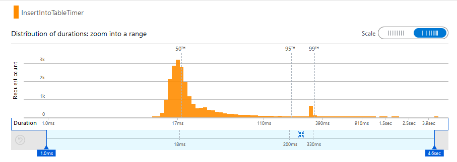
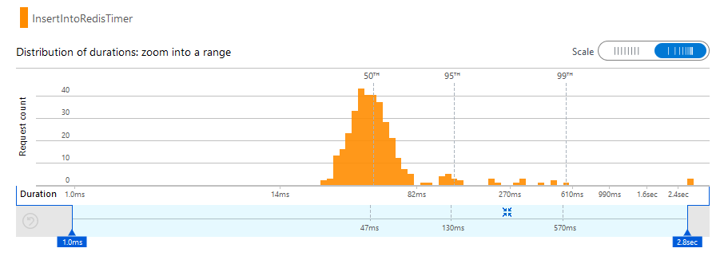
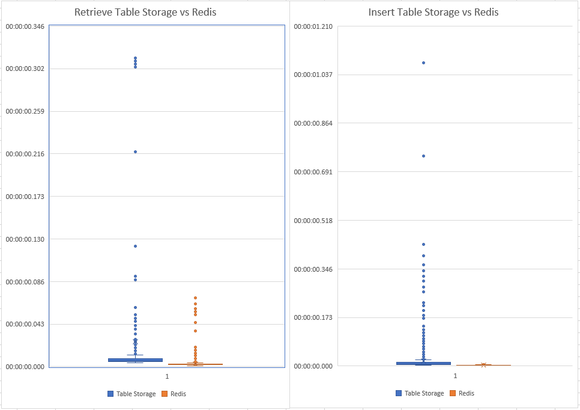

# Caching for ICAP

## Choosing a Caching Mechanism
Three main options I found for caching on Azure:
- Azure Table Storage
- Azure Cache for Redis
- Azure Cosmos DB 

 

### Azure Table Storage
Pros:
- Fast (~50ms insert, ~50ms query)
- Data is persisted
- Scaled to 500TB
- Code is compatible with Cosmos DB should the client require that solutions

Cons:
-	Global Replication is possible, but secondary region is only read only
-	Limited to 1MB per entity

### Azure Cache for Redis
Pros: 
- More features (pub/sub, content eviction)
Cons:
- No Data Persistence unless on premium (£307 a month - Cheapest Premium)
- Low Cache sizes
- More expensive than table storage

### Azure Cosmos DB
Pros:
- Single Digit millisecond response time
- 99.999% availability
- Multi-master global distribution
- Code is compatible with Tablel Storage should the client require that solution
Cons:
- Expensive
- Overkill for what we need

---

## Spike Testing
### Azure Table Storage
Function to insert an entity (file hash, file type, file status).  
Function to retieve an entity based on an existing hash.  
23745 entities inserted over the weekend.  
Average times:
- Inserting Entity - 43.4ms
- Retrieving Entity based on hash - 23.7ms

### Azure Cache for Redis
Function to insert an entity (file hash, file type, file status).  
Function to retieve an entity based on an existing hash.  
Average times:
- Inserting Entity - 86.5.4ms
- Retrieving Entity based on hash - 85.4ms  

These times are based on the completion of the whole function (creating client to data storage, creating entity, performing action).  

I wrapped the executing of the action in a stopwatch to isolate just those metrics. From this I found Redis retrieval and insert is quicker than Azure table storage. However it does take longer to complete the whole function due to the creation of the Redis client taking longer than the creation of the Storage Account client. 

Documents recommend keeping the connection to the Redis cache open and re-using this across multiple calls, however more research would need to be done to know if this is possible.  

Another consideration would be the lack of persistence on Redis outside of the premium tier. We would need to store the data externally (SQL, NoSQL) and load on a fresh instance of Redis. 

